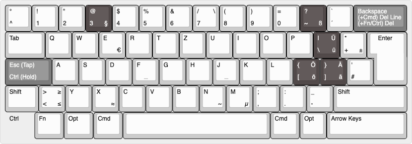

# Karabiner

The keyboard layout is depicted at the [Keyboard Layout Editor](https://www.keyboard-layout-editor.com/#/gists/d6cd52c32f58961aaa542d584924a196)

The base layout is a 60% German ISO layout for macOS:

It consists of the following custom rules:
- ⇪ Caps Lock → [ Control with other keys, ESC if pressed alone ]
- Swap ^ and < (Logitech Bug)
- Swap left cmd with left option (Logitech Bug)
- Swap right cmd with right option (Logitech Bug)
- Map Control + Backspace to Delete
- German Layout - Replace Umlaute with Programming Keys

# iTerm

- Dark Theme: Dracula+
- Light Theme: One Half Light
- Font: Monaspace Argon Light 12pt
- Key Mappings:
    - Option + Delete: 0x17
    - Cmd + Delete: 0x15
    - Option + Left: Escape Sequence: b
    - Cmd + Left: 0x01
    - Option + Right: Escape Sequence: f
    - Cmd + Right: 0x05

# kmonad

Not implemented yet.